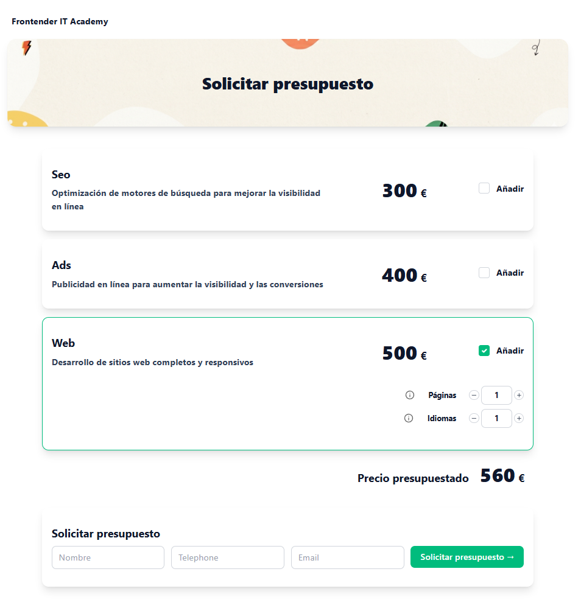
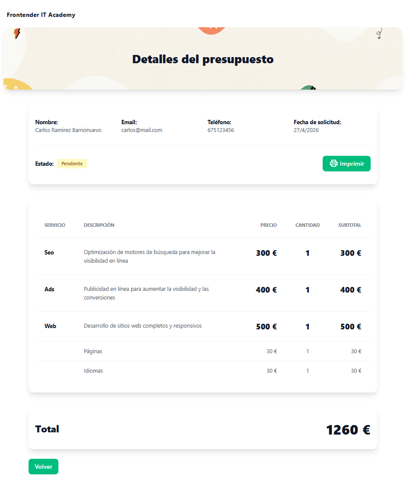

# Budget

Aplicación web para la gestión y simulación de presupuestos de servicios.

## Descripción
Budget es una aplicación desarrollada para facilitar la creación, edición y visualización de presupuestos personalizados, permitiendo seleccionar servicios y subservicios, calcular totales y gestionar propuestas de manera sencilla e intuitiva.

## Tecnologías utilizadas
- **Angular** (v21.2.7)
- **TypeScript**
- **Tailwind CSS**
- **HTML5**
- **Vitest** (pruebas unitarias)

## Demo en línea
Puedes probar la aplicación en: [https://budget.crbarrio.es](https://budget.crbarrio.es)

## Instalación y ejecución
1. Clona el repositorio:
	```bash
	git clone https://github.com/crbarrio/budget.git
	cd budget
	```
2. Instala las dependencias:
	```bash
	npm install
	```
3. Inicia el servidor de desarrollo:
	```bash
	ng serve
	```
4. Accede a la aplicación en tu navegador en [http://localhost:4200](http://localhost:4200)

## Ejecutar tests unitarios
Para correr los tests unitarios ejecuta:
```bash
ng test
```

## Estructura del proyecto
- `src/app/components/`: Componentes reutilizables (formularios, ítems, cabecera, navbar, etc.)
- `src/app/pages/`: Páginas principales de la aplicación (inicio, detalles, servicios)
- `src/app/services/`: Servicios de lógica de negocio y gestión de datos
- `src/app/interfaces/`: Definición de interfaces TypeScript
- `src/app/text/`: Textos y recursos estáticos

## Capturas de pantalla






---

Este proyecto es parte de la especialización en desarrollo web de IT Academy.
